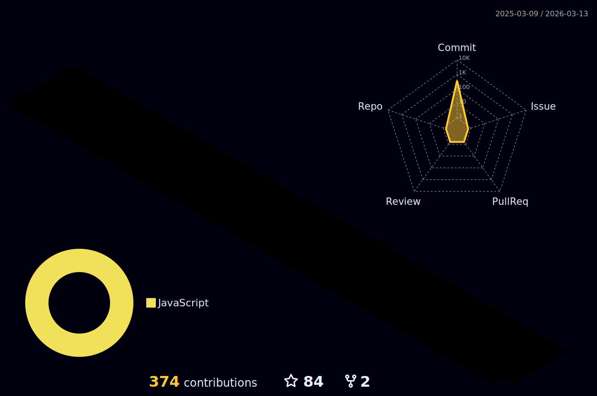

&nbsp;&nbsp;
&nbsp;&nbsp;
&nbsp;&nbsp;

&nbsp;
&nbsp;&nbsp;
&nbsp;&nbsp;

  

 

 

Welcome to my Profile. I am Ha Van Quoc Dung , Now I am learning web programming and in the future I want to learn more things.

## Git contributions
  

## My favorite tools and technologies ⚙️ 

> Tools and technologies that I have worked with and am interested in

<table>
  <tr>
    <td align="center" width="96">
        
       Javascript
    </td>
    <td align="center" width="96">
        
       GraphQL
    </td>
    <td align="center" width="96">
    
     MySQL
  </tr>
  <tr>
    <td align="center" width="96"> 
        
       Git
    </td>
    <td align="center" width="96">
        
       Github
    </td>
    <td align="center"  width="96">
        
       HTML
    </td>
    <td align="center" width="96">
        
       CSS
    </td>
    <td align="center" width="96">
        
       PostgreSQL
    </td>
     </td>
        <td align="center" width="96">
        
       Postman
    </td>
     </td>
        <td align="center" width="96">
        
       NodeJs
    </td>
    <td align="center" width="96">
        
       mongoDB
    </td>
  </tr>
  
  <!--- &nbsp;&nbsp;-->

_**It is not uncommon for people to spend their whole life waiting to start living.**_

Eckhart Tolle

_**You always succeed in producing a result.**_

Tony Robbins

_**I cannot give you the formula for success, but I can give you the formula for failure: which is: Try to please everybody.**_

Herbert Bayard Swope

_**Although there may be tragedy in your life, there's always a possibility to triumph. It doesn't matter who you are, where you come from. The ability to triumph begins with you. Always.**_

Oprah Winfrey

_**If it is not right do not do it; if it is not true do not say it.**_

Marcus Aurelius

_**Life is a gift, and it offers us the privilege, opportunity, and responsibility to give something back by becoming more**_

Tony Robbins

_**Love and compassion open our own inner life, reducing stress, distrust and loneliness.**_

Dalai Lama

_**Be your own hero, it's cheaper than a movie ticket.**_

Doug Horton

_**Do not be too timid and squeamish about your reactions. All life is an experiment. The more experiments you make the better.**_

Ralph Waldo Emerson

_**When you have got an elephant by the hind legs and he is trying to run away, it's best to let him run.**_

Abraham Lincoln

_**The greatest pleasure I know is to do a good action by stealth, and to have it found out by accident.**_

Charles Lamb

_**The beginning of wisdom is found in doubting; by doubting we come to the question, and by seeking we may come upon the truth.**_

Peter Abelard

_**If your actions inspire others to dream more, learn more, do more and become more, you are a leader.**_

John Quincy Adams

_**Both formerly and now, it is only suffering that I describe, and the cessation of suffering.**_

The Buddha

_**You cannot have what you do not want.**_

John Acosta

_**Self-trust is the first secret of success.**_

Ralph Waldo Emerson

_**I want you to be everything that's you, deep at the center of your being.**_

Confucius

_**Decision is a risk rooted in the courage of being free.**_

Paul Tillich

_**Aerodynamically the bumblebee shouldn't be able to fly, but the bumblebee doesn't know that, so it goes on flying anyway.**_

Mary Kay Ash

_**When I dare to be powerful, to use my strength in the service of my vision, then it becomes less and less important whether I am afraid.**_

Audre Lorde

_**All this modern technology just makes people try to do everything at once.**_

Bill Watterson

_**He that respects himself is safe from others; he wears a coat of mail that none can pierce.**_

Henry Wadsworth Longfellow

_**In friendship as well as love, ignorance very often contributes more to our happiness than knowledge.**_

François de La Rochefoucauld

_**Goals are the fuel in the furnace of achievement.**_

Brian Tracy

_**Adversity has the effect of eliciting talents, which in prosperous circumstances would have lain dormant.**_

Horace

_**Age does not protect you from love. But love, to some extent, protects you from age.**_

Anaïs Nin

_**All that I am, or hope to be, I owe to my angel mother.**_

Abraham Lincoln

_**By letting it go it all gets done. The world is won by those who let it go. But when you try and try. The world is beyond the winning.**_

Laozi

_**I'm selfish, impatient and a little insecure. I make mistakes, I am out of control and at times hard to handle. But if you can't handle me at my worst, then you sure as hell don't deserve me at my best.**_

Marilyn Monroe

_**Friendship, like the immortality of the soul, is too good to be believed.**_

Ralph Waldo Emerson

_**To understand the heart and mind of a person, look not at what he has already achieved, but at what he aspires to do.**_

Kahlil Gibran

_**The more sand that has escaped from the hourglass of our life, the clearer we should see through it.**_

Jean-Paul Sartre

_**Never idealize others. They will never live up to your expectations.**_

Leo Buscaglia

_**If facts are the seeds that later produce knowledge and wisdom, then the emotions and the impressions of the senses are the fertile soil in which the seeds must grow.**_

Rachel Carson

_**Freedom is not worth having if it does not connote freedom to err.**_

Mahatma Gandhi

_**A prudent question is one half of wisdom.**_

Francis Bacon

_**The possession of knowledge does not kill the sense of wonder and mystery. There is always more mystery.**_

Anaïs Nin

_**All perceiving is also thinking, all reasoning is also intuition, all observation is also invention.**_

Rudolf Arnheim

_**Never doubt that a small group of thoughtful, committed people can change the world. Indeed. It is the only thing that ever has.**_

Margaret Mead

_**A dream is your creative vision for your life in the future. You must break out of your current comfort zone and become comfortable with the unfamiliar and the unknown.**_

Denis Waitley

_**You're never a loser until you quit trying.**_

Mike Ditka

_**I'd rather regret the things that I have done than the things that I have not done.**_

Lucille Ball

_**Go for it now. The future is promised to no one.**_

Wayne Dyer

_**Wise men make more opportunities than they find.**_

Francis Bacon

_**We may encounter many defeats, but we must not be defeated.**_

Maya Angelou

_**The pain passes, but the beauty remains.**_

Pierre-Auguste Renoir

_**To dare is to lose ones footing momentarily. To not dare is to lose oneself.**_

Søren Kierkegaard

_**Finding good players is easy. Getting them to play as a team is another story.**_

Casey Stengel

_**Make it your habit not to be critical about small things.**_

Edward Everett Hale

_**Bad times have a scientific value. These are occasions a good learner would not miss.**_

Ralph Waldo Emerson

_**Without some goals and some efforts to reach it, no man can live.**_

John Dewey

_**I know where I'm going and I know the truth, and I don't have to be what you want me to be. I'm free to be what I want.**_

Muhammad Ali

_**Sadness flies away on the wings of time.**_

Jean de La Fontaine

_**The sincere friends of this world are as ship lights in the stormiest of nights.**_

Giotto

_**There is nothing in a caterpillar that tells you it's going to be a butterfly.**_

Buckminster Fuller

_**Lord, make me an instrument of thy peace. Where there is hatred, let me sow love.**_

Francis of Assisi

_**He who lives in harmony with himself lives in harmony with the world.**_

Marcus Aurelius

_**The person born with a talent they are meant to use will find their greatest happiness in using it.**_

Johann Wolfgang von Goethe

_**Life is so constructed that an event does not, cannot, will not, match the expectation.**_

Charlotte Brontë
