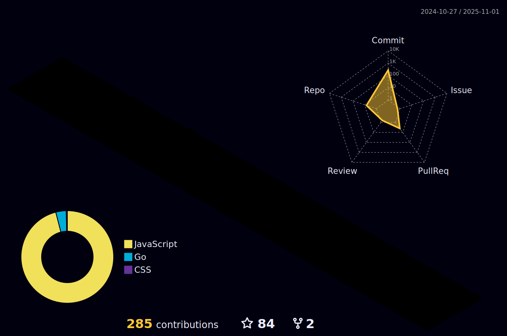

&nbsp;&nbsp;
&nbsp;&nbsp;
&nbsp;&nbsp;

&nbsp;
&nbsp;&nbsp;
&nbsp;&nbsp;

  

 

 

Welcome to my Profile. I am Ha Van Quoc Dung , Now I am learning web programming and in the future I want to learn more things.

## Git contributions
  

## My favorite tools and technologies ⚙️ 

> Tools and technologies that I have worked with and am interested in

<table>
  <tr>
    <td align="center" width="96">
        
       Javascript
    </td>
    <td align="center" width="96">
        
       GraphQL
    </td>
    <td align="center" width="96">
    
     MySQL
  </tr>
  <tr>
    <td align="center" width="96"> 
        
       Git
    </td>
    <td align="center" width="96">
        
       Github
    </td>
    <td align="center"  width="96">
        
       HTML
    </td>
    <td align="center" width="96">
        
       CSS
    </td>
    <td align="center" width="96">
        
       PostgreSQL
    </td>
     </td>
        <td align="center" width="96">
        
       Postman
    </td>
     </td>
        <td align="center" width="96">
        
       NodeJs
    </td>
    <td align="center" width="96">
        
       mongoDB
    </td>
  </tr>
  
  <!--- &nbsp;&nbsp;-->

_**There's such a thin line between winning and losing.**_

John R. Tunis

_**It is easy to sit up and take notice, What is difficult is getting up and taking action.**_

Honore de Balzac

_**If you're not making mistakes, you're not taking risks, and that means you're not going anywhere. The key is to make mistakes faster than the competition, so you have more changes to learn and win.**_

John W. Holt, Jr.

_**When you recover or discover something that nourishes your soul and brings joy, care enough about yourself to make room for it in your life.**_

Jean Shinoda Bolen

_**Limitations are like mirages created by your own mind. When you realise that limitation do not exist, those around you will also feel it and allow you inside their space.**_

Stephen Richards

_**If we are not stretching, we are not growing. If we are not growing, we are probably not fulfilling our potential. The only person in this room that knows your potential is you.**_

Kevin Turner 

_**Stop complaining. Start creating.**_

Dale Patridge

_**If you cannot do great things, do small things in a great way.**_

Napoleon Hill

_**Failure is the condiment that gives success its flavor.**_

Truman Capote

_**Things are not bad in themselves, but our cowardice makes them so.**_

Michel de Montaigne

_**Life is like a camera: just focus on what is important, capture good times, develop from negative, and if things do not work out, take another shot!**_

Daireth Winehouse

_**We are each gifted in a unique and important way. It is our privilege and our adventure to discover our own special light**_

Mary Dunbar

_**The man who has confidence in himself gains the confidence of others.**_

Hasidic Proverb
